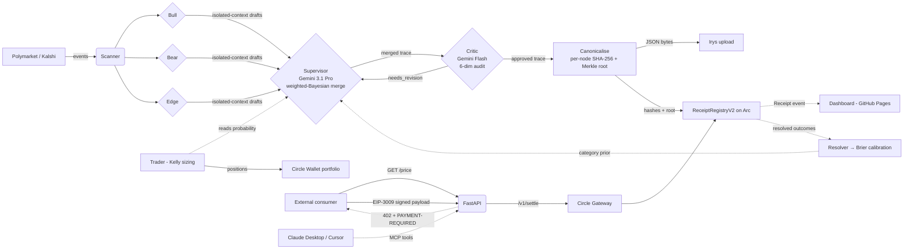

# ReasoningReceipt

> **An x402-paywalled AI oracle for prediction markets where the reasoning trace *is* the product.**
> Every price ships with a hashed, byte-verifiable chain-of-thought. Settled on Arc in under a second for ~$0.0007 gas.

[](https://github.com/tang-vu/reasoning-receipt/actions/workflows/ci.yml)
[](LICENSE)
[](https://www.python.org/downloads/)
[](https://soliditylang.org)
[](https://nextjs.org)

---

## Live now

| | |
|---|---|
| 🌐 **Dashboard** (live + snapshot fallback) | https://rrtrace.xyz |
| 🔌 **Live API** (FastAPI via Cloudflare Tunnel) | https://api.rrtrace.xyz/stats |
| 📡 **SSE event stream** | https://events.rrtrace.xyz/events/stream |
| 🌳 **ReceiptRegistryV2** (Merkle root + schemaVersion, source-verified) | https://testnet.arcscan.app/address/0x27d93c52fea923f956345af27f61d7bf47f0c4c1 |
| 🔍 **ReceiptRegistry V1** (source-verified) | https://testnet.arcscan.app/address/0x59022EFd46a697bbf2fAd36CcfA8F2099f0bd1Bf |
| 📜 **Receipts emitted on-chain** | **4,558** and rising (V1: 2,281 legacy · V2: 2,277 Merkle-rooted rr-trace/3, byte-verifiable from #2273 forward) |
| 🎯 **Distinct markets priced** | **217** across **Polymarket Gamma + Kalshi Trade API** (RFB 03 plural) |
| 💰 **Per-receipt gas cost** | **$0.000683 USDC** (~1/15 of a cent) |
| 🧪 **Cross-chain demo** | 1 USDC moved Sepolia → Arc via CCTP V2 ([burn tx](https://sepolia.etherscan.io/tx/0x2aebe23128bb7742c6c3babbd32889c29f3b938940176c41d794169a28f4d615) / [mint tx](https://testnet.arcscan.app/tx/0x8a4ae433cfef773298bb766e1ea4c2d5d1f5005f3a5002fbe03439c370baeccf)) |
| 🏷️ **Latest release** | [v0.4.0 — Kalshi + App Kit + Merkle playground](https://github.com/tang-vu/reasoning-receipt/releases/tag/v0.4.0) |

**Verify the wedge yourself** — pull any v3 trace from the public Irys gateway and re-hash it client-side:

```bash
uv run python -m scripts.verify-receipt 2580 --base-url https://api.rrtrace.xyz
# verdict           : VERIFIED [OK]
```

Or offline, without trusting our server: pass a `--cid` and `--expected-hash`, the script fetches from `gateway.irys.xyz` directly and recomputes SHA-256. For a single evidence URL inside the trace, the V2 contract's `verifyInclusion(root, leaf, proof)` view accepts a ~200-byte Merkle proof — no full trace download required.

---

## What it is

A paid oracle: pay a few cents of USDC over [x402 v2](https://docs.cdp.coinbase.com/x402/docs/welcome), get a probability for a **Polymarket or Kalshi event**, **plus a receipt** — a hashed, byte-verifiable, **Merkle-rooted reasoning DAG** committed to Arc.

Each market goes through a **5-agent ensemble**:

1. **Bull**, **Bear**, **Edge** — three Gemini researchers run in parallel with **isolated context**. Bull argues YES, Bear argues NO, Edge surfaces tail risks both partisans take for granted. Default model is Gemini 3 Flash Preview (advocacy generators don't need Pro reasoning; Pro is reserved for synthesis below — see `docs/ARCHITECTURE.md`).
2. **Supervisor** (Gemini 3.1 Pro Preview) — weighted-Bayesian merge with stance weights ∈ [0.1, 0.7] summing to 1.0. Mandates ≥ 1 falsifiable claim with a `checkable_by` date. Consumes a per-category Brier prior from past resolutions.
3. **Critic** (Gemini Flash) — audits across six rigor dimensions: evidence relevance, falsifiability, scope, coherence, exploration integrity, methodology. Verdict gates publication; rejected receipts never reach the chain.

Every node of the resulting DAG (claim, evidence, counter-arguments, sensitivity factors, falsifiable claims, critic dimensions) gets its own SHA-256, and a **Merkle root** over all nodes lives on Arc inside `ReceiptRegistryV2.sol`. Anyone can pull the trace from Irys, re-canonicalise it, re-hash it, and byte-match — or challenge a single evidence URL with a ~200-byte inclusion proof via `verifyInclusion(root, leaf, proof)`. **There is no "trust the publisher" step.**

The product isn't the number. The product is the auditable trace.

## Architecture



The agent loop runs continuously. The **scanner** filters Polymarket Gamma and Kalshi's Trade API for liquid, near-resolution, single-question markets. Each market then goes through the **5-agent ensemble**: **Bull**, **Bear** and **Edge** draft competing stances in parallel with isolated context (Google Search grounded); the **Supervisor** (Gemini 3.1 Pro Preview via Vertex AI on the `global` endpoint) merges them weighted-Bayesian, mandates a falsifiable claim, and folds in a per-category Brier prior from past resolutions; the **Critic** (Gemini Flash) audits across six rigor dimensions and gates publication — on `needs_revision` the Supervisor revises once, on `rejected` the receipt never reaches the chain. The approved trace is canonicalised, every node SHA-256'd, a Merkle root computed, the JSON pinned to Irys, and a `Receipt(...)` event emitted on `ReceiptRegistryV2`. The **trader** Kelly-sizes a position from the agent's portfolio wallet. The **FastAPI server** exposes the same oracle behind an x402-v2 paywall. The **resolver** polls for closed markets and back-fills resolved outcomes so the **calibration** module reports a per-category Brier score — which loops back into the Supervisor's prior.

## Six Circle products in production

| Product | Role |
|---|---|
| **Arc Testnet** | Settlement chain. Per-receipt gas $0.000683 measured across 4,500+ emissions. |
| **USDC** | Native gas + paywall asset. |
| **Circle Wallets** (developer-controlled) | Portfolio wallet (trader) + consumer wallet (agent pays own oracle), provisioned headlessly via [`scripts/circle-setup.py`](scripts/circle-setup.py) in ~4 seconds — entity secret RSA-OAEP-encrypted client-side, walletSet + 2 wallets via one POST each. |
| **Gateway / Nanopayments (x402 v2)** | `PAYMENT-REQUIRED` headers, EIP-3009 `TransferWithAuthorization` typed-data, settle via `gateway-api-testnet.circle.com/v1/settle`. |
| **CCTP V2** | [`scripts/cctp-demo.py`](scripts/cctp-demo.py) — direct-mint path, Sepolia → Arc Testnet, attestation `pending_confirmations` → `complete` in ~12 s, end-to-end in ~60 s. Burn + mint tx hashes linked above. |
| **App Kit · Unified Balance** | [`services/app-kit/demo.ts`](services/app-kit/demo.ts) — `@circle-fin/app-kit@1.5.1` + `@circle-fin/adapter-viem-v2@1.11.0`. Returns a structured per-chain USDC breakdown across **all 12 testnet chains incl. Arc Testnet** for the agent operator EOA. SDK is wired end-to-end; `kit.unifiedBalance.spend()` ready for a Gateway-deposited spend. |

## Quick start

```bash
# 1. Clone + install
git clone https://github.com/tang-vu/reasoning-receipt && cd reasoning-receipt
uv sync --extra dev

# 2. Provision Circle wallets headlessly (one-time, fills .env)
cp .env.example .env
# (set CIRCLE_API_KEY from console.circle.com, then:)
uv run python -m scripts.circle-setup

# 3. Deploy ReceiptRegistry to Arc (one-time)
./scripts/deploy-contract.sh   # writes RECEIPT_REGISTRY_ADDRESS to .env

# 4. Run the agent loop (continuous)
uv run python -m agent.loop

# 5. (optional) Serve x402-paywalled /price endpoint for external consumers
uv run uvicorn server.main:app --reload

# 6. (optional) Local dashboard
cd dashboard && npm install && npm run dev
```

See [docs/ARCHITECTURE.md](docs/ARCHITECTURE.md) for the full design, [docs/DEMO.md](docs/DEMO.md) for the demo walkthrough, [docs/SUBMISSION.md](docs/SUBMISSION.md) for the Agora form text, and [docs/mcp.md](docs/mcp.md) for the Claude Desktop / Cursor integration.

## MCP — oracle as a tool in Claude Desktop / Cursor

`services/mcp/server.js` wraps the oracle as a stdio MCP server. Drop this into your `claude_desktop_config.json` and Claude calls our oracle as a first-class tool:

```json
{
  "mcpServers": {
    "reasoning-receipt": {
      "command": "node",
      "args": ["<path-to-repo>/services/mcp/server.js"],
      "env": { "RR_API_BASE": "http://localhost:8000" }
    }
  }
}
```

Four tools: `get_price`, `verify_receipt`, `get_stats`, `get_calibration`. Full setup in [docs/mcp.md](docs/mcp.md).

### Paywalled MCP — agents pay x402 to call the oracle

For agent-to-agent commerce we also expose an x402-paywalled HTTP variant under `/mcp/v1/` on the same FastAPI server. Two tools:

```
GET https://api.rrtrace.xyz/mcp/v1/get_price/{market_id}    # $0.01 USDC
GET https://api.rrtrace.xyz/mcp/v1/audit/{receipt_id}       # $0.01 USDC
```

Both return a Circle x402 v2 challenge on first call (`network: eip155:5042002`, `amount: 10000` micro-USDC, `payTo`: oracle receiver, `verifyingContract`: Arc Testnet Gateway Wallet). The consumer agent signs an EIP-3009 `TransferWithAuthorization`, retries with `X-Payment`, the server settles via `gateway-api-testnet.circle.com/v1/settle` and returns the cached latest price (or byte-for-byte audit) for that market. Pure agent-to-agent revenue path: no upstream Gemini / Arc gas cost per call because the receipt was already pre-minted by the daemon.

## Repo layout

```
agent/        Scanner (Polymarket + Kalshi, round-robin interleave), 5-agent
              ensemble (Bull/Bear/Edge + Supervisor + Critic), trace_v3
              (Merkle DAG), trader, resolver (Polymarket Gamma + Kalshi Trade
              API → resolved outcomes), calibration (per-category Brier feed)
server/       FastAPI + x402-v2 paywall + Arc chain client (V1 + V2) + SSE
              event stream + verify endpoint + paywalled MCP HTTP variant
contracts/    ReceiptRegistry.sol (V1) + ReceiptRegistryV2.sol (V2 with
              merkleRoot + verifyInclusion view), both source-verified on Arc
storage/      Irys sidecar dispatcher + SQLAlchemy ORM (SQLite dev / Postgres prod)
wallets/      Circle developer-controlled wallets + Kelly trader portfolio
dashboard/    Next.js 15 — Home / Agents / Traces / Trace detail / Inclusion
              / Calibration / Events / Stats / Try. Hybrid mode: live API
              first, snapshot fallback. Auto-deployed to GitHub Pages.
services/
  irys/         Node sidecar for @irys/upload Bundlr-signed uploads
  mcp/          MCP stdio server for Claude Desktop / Cursor / Cline
  app-kit/      Circle App Kit Unified Balance demo (TypeScript, tsx)
scripts/      Setup, demo runner, healthcheck, safe-push, deploy-contract
              (V1 + V2), circle-setup (headless), cctp-demo, verify-receipt
              CLI, record-demo, export-snapshot, seed-demo, multi-consumer-
              burst, services-watchdog
tests/        115 pytest tests (e2e + unit, incl. Kalshi scanner + resolver
              + interleave + ensemble) — all green in CI; 33 forge tests on
              ReceiptRegistry + V2 + CanteenUSDC
docs/         architecture / demo / submission / mcp / canteen-walkthrough /
              x402-real-settlement / pitch-script
```

## Tech stack

- **Agent**: Python 3.11+, `uv`, FastAPI, `google-genai` SDK against Vertex AI (`global` endpoint, with Google Search grounding). Role-tuned model routing — stances on **Gemini 3 Flash Preview** (advocacy generators, ~50× cheaper output than Pro), supervisor on **Gemini 3.1 Pro Preview**, critic on Flash. Per-call fallback chain handles quota / 429 / empty-response across all roles.
- **Multi-agent loop (rr-trace/3)**: Bull / Bear / Edge in parallel (isolated context, Google Search grounded) → Supervisor weighted-Bayesian merge with mandatory falsifiable claim → Critic six-dim ARA audit. Single-pass revision when any dim < 0.4; rejected receipts never reach the chain.
- **Markets**: Polymarket Gamma API + Kalshi Trade API (both public reads, no auth). Round-robin interleave so `per_tick` slices both sources every tick. Source-specific liquidity floors ($10k Polymarket 24h volume / $2k Kalshi open-interest × last-price).
- **Settlement**: Arc Testnet (chain id 5042002), Solidity 0.8.26 via Foundry 1.7.1. **V1 + V2 contracts**, both source-verified on testnet.arcscan.app. V2 commits `merkleRoot` + `schemaVersion` and exposes `verifyInclusion(root, leaf, proof)`.
- **Paywall**: x402 v2 spec-compliant headers (`PAYMENT-REQUIRED`, `eip155:5042002`, Gateway Wallet `verifyingContract`), Circle facilitator `/v1/settle`.
- **Wallets**: Circle developer-controlled — portfolio + consumer pair, entity secret registered via API (`scripts/circle-setup.py`).
- **Cross-chain**: CCTP V2 direct-mint path (TokenMessengerV2 + MessageTransmitterV2 + Iris attestation).
- **Unified Balance**: Circle App Kit (`@circle-fin/app-kit@1.5.1` + adapter-viem-v2) — reads agent operator USDC across 12 testnet chains incl. Arc as one pool. See `services/app-kit/`.
- **Storage**: Irys (Bundlr-signed uploads via tiny Node sidecar) + SQLAlchemy 2.0.
- **Dashboard**: Next.js 15 static export, deployed automatically to GitHub Pages on every push. Hybrid mode — live API first (`api.rrtrace.xyz` via Cloudflare Tunnel) with client-side refresh on mount, snapshot fallback when the tunnel hiccups.
- **MCP**: `@modelcontextprotocol/sdk` stdio server (4 tools, free) + paywalled HTTP variant at `/mcp/v1/{get_price,audit}` ($0.01 USDC per call, same x402 envelope).

## Why this is interesting

Most "AI agents on chain" emit hashes of opaque blobs. ReasoningReceipt commits to the **full chain-of-thought** — including the sources the Bull/Bear/Edge stances actually cited (Google Search grounded), the counter-arguments they weighed, the sensitivity factors considered, and the critic's six-dimension audit of all of the above. Then we measure ourselves: the resolver scrapes Polymarket for closed markets, and the calibration module reports a Brier score against actual outcomes.

The wedge is per-call economics: classical L1 gas makes a $0.01 oracle query nonsensical. On Arc, the receipt costs **less than the answer it commits to** — and that flips the entire product shape from "trust me" to "verify me."

## License

MIT — see [LICENSE](LICENSE).
