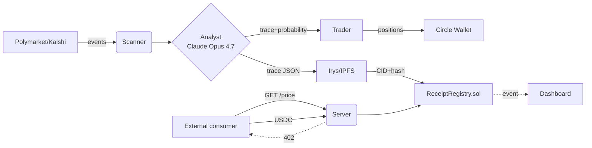

# ReasoningReceipt

> An x402-paywalled AI oracle for prediction markets where the **reasoning trace is the product**. Every response includes a full hashed chain-of-thought, settled on Arc in under a second for ~$0.01.

[](LICENSE)
[](https://www.python.org/downloads/)
[](https://soliditylang.org)

ReasoningReceipt is a paid oracle: pay a few cents of USDC over [x402](https://docs.cdp.coinbase.com/x402/docs/welcome), get a price for a prediction-market event plus a **receipt** — a hashed, on-chain pointer to the full reasoning trace that produced it. The trace lives on Irys/IPFS, the hash + CID sit in `ReceiptRegistry.sol` on Arc, the response settles in under a second.

The product isn't the number. The product is the **auditable trace** behind the number.

## Architecture



The agent runs continuously: scans Polymarket and Kalshi for liquid, near-resolution events, asks Claude Opus 4.7 to produce a probability + counter-arguments + cited sources, hashes that canonical JSON, pins it to Irys, emits a `Receipt` event on Arc, and (separately) takes a Kelly-sized position with its own portfolio wallet. The FastAPI server exposes the same oracle behind an x402 paywall to outside consumers.

## Quick start

```bash
# 1. Clone + install
git clone https://github.com/tang-vu/reasoning-receipt && cd reasoning-receipt
uv sync

# 2. Fill in .env (see .env.example)
cp .env.example .env

# 3. Run the server
uv run uvicorn server.main:app --reload

# 4. Run the agent loop (separate terminal)
uv run python -m agent.loop

# 5. Run the dashboard (separate terminal)
cd dashboard && npm install && npm run dev
```

See [docs/ARCHITECTURE.md](docs/ARCHITECTURE.md) for the full design and [docs/DEMO.md](docs/DEMO.md) for the demo walkthrough.

## Repo layout

```
agent/        Scanner, analyst, trader, trace, prompts
server/       FastAPI + x402 paywall + on-chain settlement
contracts/    Solidity ReceiptRegistry + foundry tests
storage/      Irys uploader, SQLite/Postgres ORM
wallets/      Circle developer-controlled wallet + PnL
dashboard/    Next.js 15 + Tailwind + Recharts (deployed to Vercel)
scripts/      Setup, demo runner, healthcheck, safe-push
tests/        End-to-end + unit tests
docs/         Architecture, demo, submission text
```

## Tech stack

- **Agent**: Python 3.11+ / FastAPI / Anthropic SDK (Claude Opus 4.7 for reasoning, Sonnet 4.6 for scanning, Haiku 4.5 for classification)
- **Markets**: Polymarket CLOB + Kalshi
- **Settlement**: Arc testnet, Solidity 0.8.26, Foundry
- **Paywall**: x402 + Circle Nanopayments
- **Wallets**: Circle developer-controlled wallets
- **Storage**: Irys (primary, IPFS CID-compatible) + SQLite/Postgres
- **Dashboard**: Next.js 15 + Tailwind + Recharts on Vercel

## Why this is interesting

Most "AI agents on chain" emit hashes of opaque blobs. ReasoningReceipt commits to the **full chain-of-thought** — including the sources Claude actually cited, the counterarguments it weighed, and the confidence calibration it produced. The hash on Arc lets anyone verify the trace they fetch is the exact trace the oracle published. The agent then **eats its own cooking** — its portfolio wallet consumes the same oracle to size positions, so the on-chain volume is real, not synthetic.

The wedge is per-call economics: classical L1 gas makes a $0.01 query nonsensical. On Arc, the receipt costs less than the answer.

## License

MIT — see [LICENSE](LICENSE).
