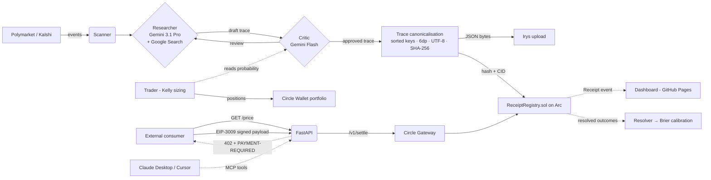

# ReasoningReceipt

> **An x402-paywalled AI oracle for prediction markets where the reasoning trace *is* the product.**
> Every price ships with a hashed, byte-verifiable chain-of-thought. Settled on Arc in under a second for ~$0.0007 gas.

[](https://github.com/tang-vu/reasoning-receipt/actions/workflows/ci.yml)
[](LICENSE)
[](https://www.python.org/downloads/)
[](https://soliditylang.org)
[](https://nextjs.org)

---

## Live now

| | |
|---|---|
| 🌐 **Dashboard** | https://rrtrace.xyz |
| 🌳 **ReceiptRegistryV2** (Merkle root + schema version, source-verified) | https://testnet.arcscan.app/address/0x27d93c52fea923f956345af27f61d7bf47f0c4c1 |
| 🔍 **ReceiptRegistry V1** (source-verified) | https://testnet.arcscan.app/address/0x59022EFd46a697bbf2fAd36CcfA8F2099f0bd1Bf |
| 📜 **Receipts emitted on-chain** | **2,200+** and rising (~50/hour, deployer wallet drives it autonomously) |
| 🎯 **Distinct Polymarket markets priced** | **90+** |
| 💰 **Per-receipt gas cost** | **$0.000683 USDC** (~1/15 of a cent) |
| 🧪 **Cross-chain demo** | 1 USDC moved Sepolia → Arc via CCTP V2 ([burn tx](https://sepolia.etherscan.io/tx/0x2aebe23128bb7742c6c3babbd32889c29f3b938940176c41d794169a28f4d615) / [mint tx](https://testnet.arcscan.app/tx/0x8a4ae433cfef773298bb766e1ea4c2d5d1f5005f3a5002fbe03439c370baeccf)) |
| 🏷️ **Release** | [v0.1.0-rc1](https://github.com/tang-vu/reasoning-receipt/releases/tag/v0.1.0-rc1) |

**Verify the wedge yourself** — pull any trace from the public Irys gateway and re-hash it client-side:

```bash
uv run python -m scripts.verify-receipt 1500 --base-url http://localhost:8000
# verdict           : VERIFIED [OK]
```

Or offline, without trusting our server: pass a `--cid` and `--expected-hash`, the script fetches from `gateway.irys.xyz` directly and recomputes SHA-256.

---

## What it is

A paid oracle: pay a few cents of USDC over [x402](https://docs.cdp.coinbase.com/x402/docs/welcome), get a probability for a Polymarket or Kalshi event, **plus a receipt** — a hashed, on-chain pointer to the full chain-of-thought that produced the number. The trace lives on Irys (Arweave-compatible). The SHA-256 of its canonical bytes lives on Arc inside `ReceiptRegistry.sol`. Anyone can pull the trace, re-canonicalize, re-hash, and byte-match. **There is no "trust the publisher" step.**

The product isn't the number. The product is the auditable trace.

## Architecture



The agent loop runs continuously. The **scanner** filters Polymarket Gamma for liquid, near-resolution markets. The **researcher** (Gemini 3.1 Pro Preview via Vertex AI on the `global` endpoint, with Google Search grounding) drafts a probability + sources + counter-arguments + sensitivity. The **critic** (Gemini Flash) audits the draft for fabrication, strawmen, miscalibration, missing sensitivity, internal consistency — if any category fails, the researcher revises once with the critic's notes inlined. The trace is canonicalised, hashed, pinned to Irys, and a `Receipt(...)` event is emitted on Arc. The **trader** Kelly-sizes a position on Polymarket from the agent's portfolio wallet. The **FastAPI server** exposes the same oracle behind an x402-v2 paywall. The **resolver** polls Polymarket for closed markets and back-fills resolved outcomes so the **calibration** module can report a Brier score.

## Five Circle products in production

| Product | Role |
|---|---|
| **Arc Testnet** | Settlement chain. Per-receipt gas $0.000683 measured across 1500+ emissions. |
| **USDC** | Native gas + paywall asset. |
| **Circle Wallets** (developer-controlled) | Portfolio wallet (trader) + consumer wallet (agent pays own oracle), provisioned headlessly via [`scripts/circle-setup.py`](scripts/circle-setup.py) in ~4 seconds — entity secret RSA-OAEP-encrypted client-side, walletSet + 2 wallets via one POST each. |
| **Gateway / Nanopayments (x402 v2)** | `PAYMENT-REQUIRED` headers, EIP-3009 `TransferWithAuthorization` typed-data, settle via `gateway-api-testnet.circle.com/v1/settle`. |
| **CCTP V2** | [`scripts/cctp-demo.py`](scripts/cctp-demo.py) — direct-mint path, Sepolia → Arc Testnet, attestation `pending_confirmations` → `complete` in ~12 s, end-to-end in ~60 s. Burn + mint tx hashes linked above. |

## Quick start

```bash
# 1. Clone + install
git clone https://github.com/tang-vu/reasoning-receipt && cd reasoning-receipt
uv sync --extra dev

# 2. Provision Circle wallets headlessly (one-time, fills .env)
cp .env.example .env
# (set CIRCLE_API_KEY from console.circle.com, then:)
uv run python -m scripts.circle-setup

# 3. Deploy ReceiptRegistry to Arc (one-time)
./scripts/deploy-contract.sh   # writes RECEIPT_REGISTRY_ADDRESS to .env

# 4. Run the agent loop (continuous)
uv run python -m agent.loop

# 5. (optional) Serve x402-paywalled /price endpoint for external consumers
uv run uvicorn server.main:app --reload

# 6. (optional) Local dashboard
cd dashboard && npm install && npm run dev
```

See [docs/ARCHITECTURE.md](docs/ARCHITECTURE.md) for the full design, [docs/DEMO.md](docs/DEMO.md) for the demo walkthrough, [docs/SUBMISSION.md](docs/SUBMISSION.md) for the Agora form text, and [docs/mcp.md](docs/mcp.md) for the Claude Desktop / Cursor integration.

## MCP — oracle as a tool in Claude Desktop / Cursor

`services/mcp/server.js` wraps the oracle as a stdio MCP server. Drop this into your `claude_desktop_config.json` and Claude calls our oracle as a first-class tool:

```json
{
  "mcpServers": {
    "reasoning-receipt": {
      "command": "node",
      "args": ["<path-to-repo>/services/mcp/server.js"],
      "env": { "RR_API_BASE": "http://localhost:8000" }
    }
  }
}
```

Four tools: `get_price`, `verify_receipt`, `get_stats`, `get_calibration`. Full setup in [docs/mcp.md](docs/mcp.md).

### Paywalled MCP — agents pay x402 to call the oracle

For agent-to-agent commerce we also expose an x402-paywalled HTTP variant under `/mcp/v1/` on the same FastAPI server. Two tools:

```
GET https://api.rrtrace.xyz/mcp/v1/get_price/{market_id}    # $0.01 USDC
GET https://api.rrtrace.xyz/mcp/v1/audit/{receipt_id}       # $0.01 USDC
```

Both return a Circle x402 v2 challenge on first call (`network: eip155:5042002`, `amount: 10000` micro-USDC, `payTo`: oracle receiver, `verifyingContract`: Arc Testnet Gateway Wallet). The consumer agent signs an EIP-3009 `TransferWithAuthorization`, retries with `X-Payment`, the server settles via `gateway-api-testnet.circle.com/v1/settle` and returns the cached latest price (or byte-for-byte audit) for that market. Pure agent-to-agent revenue path: no upstream Gemini / Arc gas cost per call because the receipt was already pre-minted by the daemon.

## Repo layout

```
agent/        Scanner, researcher (Gemini), critic (Gemini Flash), trader,
              resolver (Polymarket → resolved outcomes), calibration (Brier)
server/       FastAPI + x402-v2 paywall + Arc chain client + SSE event stream
              + verify endpoint
contracts/    ReceiptRegistry.sol (source-verified on Arc Testnet) + Foundry
storage/      Irys sidecar dispatcher + SQLAlchemy ORM (SQLite dev / Postgres prod)
wallets/      Circle developer-controlled wallets + Kelly trader portfolio
dashboard/    Next.js 15 — Home / Traces / Trace detail / Events / Calibration
              / Stats. Auto-deployed to GitHub Pages on every push.
services/
  irys/         Node sidecar for @irys/upload Bundlr-signed uploads
  mcp/          MCP stdio server for Claude Desktop / Cursor / Cline
scripts/      Setup, demo runner, healthcheck, safe-push, deploy-contract,
              circle-setup (headless), cctp-demo, verify-receipt CLI,
              record-demo, export-snapshot, seed-demo
tests/        24 pytest tests (e2e via TestClient + unit) — all green in CI
docs/         architecture / demo / submission / mcp
```

## Tech stack

- **Agent**: Python 3.11+, `uv`, FastAPI, `google-genai` SDK against Vertex AI (Gemini 3.1 Pro Preview on `global` endpoint, with Google Search grounding). Automatic fallback chain: Pro Preview → Gemini 3 Flash Preview → Gemini 2.5 Flash. Has fired in production when Pro Preview hits 429 quota mid-tick.
- **Multi-agent loop**: Researcher + Critic (two distinct Gemini calls per receipt; critic audits draft, researcher revises if any of 5 categories fails). Schema `rr-trace/2`.
- **Markets**: Polymarket Gamma API (no auth needed for read).
- **Settlement**: Arc Testnet (chain id 5042002), Solidity 0.8.26 via Foundry 1.7.1, contract source-verified on testnet.arcscan.app.
- **Paywall**: x402 v2 spec-compliant headers (`PAYMENT-REQUIRED`, `eip155:5042002`, Gateway Wallet `verifyingContract`), Circle facilitator `/v1/settle`.
- **Wallets**: Circle developer-controlled — portfolio + consumer pair, entity secret registered via API (`scripts/circle-setup.py`).
- **Cross-chain**: CCTP V2 direct-mint path (TokenMessengerV2 + MessageTransmitterV2 + Iris attestation).
- **Storage**: Irys (Bundlr-signed uploads via tiny Node sidecar) + SQLAlchemy 2.0.
- **Dashboard**: Next.js 15 static export, deployed automatically to GitHub Pages on every push.
- **MCP**: `@modelcontextprotocol/sdk` stdio server exposing 4 tools to Claude Desktop / Cursor / Cline.

## Why this is interesting

Most "AI agents on chain" emit hashes of opaque blobs. ReasoningReceipt commits to the **full chain-of-thought** — including the sources the analyst actually cited (Google Search grounded), the counter-arguments it weighed, the sensitivity factors it considered, and the critic's audit of all of the above. Then we measure ourselves: the resolver scrapes Polymarket for closed markets, and the calibration module reports a Brier score against actual outcomes.

The wedge is per-call economics: classical L1 gas makes a $0.01 oracle query nonsensical. On Arc, the receipt costs **less than the answer it commits to** — and that flips the entire product shape from "trust me" to "verify me."

## License

MIT — see [LICENSE](LICENSE).
