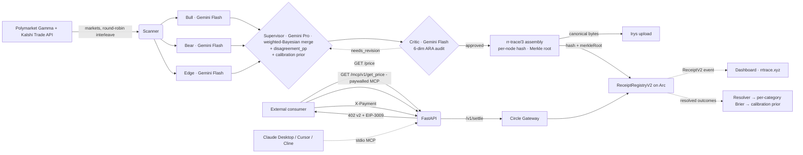

# Architecture

ReasoningReceipt is an x402-paywalled prediction-market oracle where every priced response carries a **byte-verifiable Merkle-rooted reasoning DAG** on Arc. The trace is the product.



## Component map

| Layer | Files | Job |
|---|---|---|
| Scanner | `agent/scanner.py` | Pull **Polymarket Gamma + Kalshi Trade API** markets in parallel, drop Kalshi parlays (`mve_collection_ticker`/`mve_selected_legs`), apply source-specific liquidity floors ($10k Polymarket 24h volume / $2k Kalshi open-interest×last-price), filter by horizon / language. Round-robin interleave so `per_tick=N` slices across both venues. |
| Stance researchers | `agent/ensemble.py`, `agent/prompts/{bull,bear,edge}.md` | Three Gemini calls run in parallel with isolated context — Bull argues YES, Bear argues NO, Edge surfaces tail risks. **Default model: Gemini 3 Flash Preview** (advocacy generators, ~50× cheaper output than Pro). Google Search grounding. All six knobs (`RR_ENSEMBLE_STANCE_MODEL`, `_MAX_TOKENS`, `_THINKING`, supervisor equivalents) env-tunable. |
| Supervisor | `agent/ensemble.py`, `agent/prompts/supervisor.md` | Weighted-Bayesian merge of the three stances. **Stays on Gemini 3.1 Pro Preview** — synthesis is where Pro reasoning earns its cost. Stance weights ∈ [0.1, 0.7] sum to 1.0. Mandates ≥ 1 falsifiable claim with `checkable_by` date. Consumes calibration prior from `agent/calibration_store.py`. |
| Critic | `agent/critic_v2.py`, `agent/prompts/critic-v2.md` | Six-dim ARA audit: evidence relevance, falsifiability, scope, coherence, exploration integrity, methodology. Verdict ∈ {approved, needs_revision, rejected}. Single-pass revision loop if any dim < 0.4. |
| Trace v3 | `agent/trace_v3.py`, `agent/merkle.py` | Per-node SHA-256 over the reasoning DAG, Merkle root over the node hashes (sorted-pair, SHA-256, OZ-style proofs). |
| Irys | `storage/irys.py`, `services/irys/upload.js` | Bundlr-signed upload of the canonical trace JSON. Python is the single source of truth for canonical bytes; the Node sidecar ships them verbatim. |
| Chain client | `server/chain.py` | `publish_v2` on `ReceiptRegistryV2` (merkleRoot + schemaVersion); legacy `publish` on V1 still available for compat. |
| Contracts | `contracts/src/ReceiptRegistry.sol`, `contracts/src/ReceiptRegistryV2.sol` | Both source-verified on Arc Testnet. V2 also exposes `verifyInclusion(root, leaf, proof)` view via the on-chain SHA-256 precompile. |
| x402 paywall | `server/x402.py`, `server/facilitator.py` | x402 v2 spec — `PAYMENT-REQUIRED` body, EIP-3009 typed-data, Circle Gateway `/v1/settle`. |
| FastAPI server | `server/main.py`, `server/routes.py`, `server/mcp_paywalled.py`, `server/verify.py`, `server/events.py` | `/price/{id}` paid oracle, `/verify/{id}` byte-match, `/events/stream` SSE, `/mcp/v1/{get_price,audit}` paywalled MCP. |
| Agent loop | `agent/loop.py`, `scripts/run-services.ps1` | Continuous scan → ensemble → critic → emit → trade. Runs the resolver every 10 ticks. Driven by `RR_USE_ENSEMBLE=1`. |
| Calibration | `agent/resolver.py`, `agent/calibration_store.py`, `agent/calibration.py` | Resolver polls **Polymarket Gamma + Kalshi Trade API** for closed markets and back-fills outcomes (Polymarket: `outcomePrices` ≈ 1.0 / 0.0; Kalshi: `status ∈ {finalized, settled, determined}` + `result ∈ {yes, no}`). Calibration store computes per-category Brier + over-under bias in a 30-min in-process cache. Prior text gets fed into the Supervisor prompt. |
| Trader | `agent/trader.py`, `wallets/portfolio.py` | Kelly sizing on the v2 path (v3 trader integration is Phase 6+). |
| Wallets | `wallets/circle.py` | Circle developer-controlled wallets — portfolio + consumer pair. |
| MCP stdio | `services/mcp/server.js` | Free MCP tool surface for Claude Desktop / Cursor / Cline. |
| Paywalled MCP HTTP | `server/mcp_paywalled.py` | Same tools as the stdio variant, paywalled with x402 v2 at `/mcp/v1/{get_price,audit}` — agent-to-agent revenue. |
| App Kit / Unified Balance | `services/app-kit/demo.ts` | `@circle-fin/app-kit@1.5.1` + `adapter-viem-v2@1.11.0`. Reads agent operator USDC across all 12 testnet chains (incl. Arc) as one pool. Sixth Circle product in production. |
| Dashboard | `dashboard/` | Next.js 15 static export, deployed to GitHub Pages with the `rrtrace.xyz` custom domain. **Hybrid mode** — server-renders from snapshot at build time, then client-side `useEffect` refreshes the homepage stats grid + receipts table from the live API on mount, so visiting the site never shows hour-old build data. |
| 3D DAG view | `dashboard/src/lib/trace-to-graph.ts`, `dashboard/src/components/dag-*.tsx` | Per-receipt 3D reasoning DAG (Three.js + React Three Fiber + Drei). Layered radial layout — claim at origin, stances on a ring, evidence/critic-dims/falsifiables as leaves. Replay-debate animation reveals nodes in temporal order. Mobile + `prefers-reduced-motion` fall through to the 2D SVG renderer in `dag-fallback.tsx`. Lazy-loaded via `dynamic({ ssr: false })` so the base trace page stays at 5kB. |

## Request flow — `GET /price/{market_id}` (and the paywalled MCP)

1. Consumer hits the endpoint with no `X-Payment` header.
2. Server returns **402** with the x402 v2 challenge body: `scheme: exact`, `network: eip155:5042002`, `amount: 10000` micro-USDC, `payTo`, `nonce`, and the Gateway Wallet `verifyingContract` in `extra`. The HMAC-signed challenge token lives in the `X-Payment-Challenge` response header.
3. Consumer signs an **EIP-3009 TransferWithAuthorization** typed-data payload, base64-encodes the envelope, and retries with `X-Payment` + `X-Payment-Challenge`.
4. Server verifies the HMAC challenge (resource + nonce + expiry), forwards the signed payload to Circle Gateway's `/v1/settle` (or the in-process mock facilitator).
5. For `/price/{id}`: the ensemble runs, the critic audits, the v3 trace is canonicalised + hashed + pinned to Irys, `publish_v2` emits `ReceiptV2(...)` on Arc.
6. For `/mcp/v1/get_price/{id}` and `/mcp/v1/audit/{id}`: the cached latest receipt is returned (no Gemini call, no Arc emit) — pure agent-to-agent revenue path.
7. Response body includes the price, the trace pointer (hash + CID), the Merkle root, the schema version, and the on-chain refs.

The challenge is HMAC-signed and stateless — no server-side session store.

## Trace canonicalisation + Merkle commit

```text
For each node n in the reasoning DAG:
  canonical_bytes(n) = utf-8(json.dumps(n, sort_keys=True, separators=(",",":"),
                              floats rounded to 6 dp))
  node_hash(n)       = sha256(canonical_bytes(n))

merkle_root          = sorted-pair SHA-256 fold over node_hashes
                       (OZ-style, promote-on-odd, same algorithm as
                        ReceiptRegistryV2.verifyInclusion)

trace_hash (V1 compat) = sha256(canonical_bytes(full_trace_dict))
```

Any client in any language can pull the trace from Irys, re-canonicalise each node, re-derive the root, and compare to the value on Arc. A single evidence URL can be challenged with a ~200-byte inclusion proof via `verifyInclusion(root, leaf, proof)` on the V2 contract — no full-trace download required.

## Why Arc

Per-receipt economics: posting a $0.01 receipt over a classical L1 ($0.50+ gas) is nonsense. On Arc the receipt costs ~$0.000683 USDC measured across 2,500+ emissions — **less than the answer it commits to**. That margin is what lets us paywall MCP calls profitably.

## Failure modes

| Failure | Behaviour |
|---|---|
| Gemini / Vertex outage | Per-call fallback chain (Pro Preview → Flash Preview → 2.5 Flash); has fired hundreds of times today. If all models 429, the stance falls back to a deterministic mock; trace records `model: mock:...`. |
| Critic rejects after revision | Receipt skipped entirely. Logged as `loop[v3]: REJECTED ...`, no DB row, no Arc emit, no calibration noise. |
| Arc RPC outage | Chain client returns a synthetic mock tx hash; receipt skipped on real-mode paths. |
| Irys outage | `IrysClient` enters mock mode; CID is a synthetic shortened hash. `/verify/{id}` will say "trace fetch unavailable". |
| Polymarket schema drift | Scanner catches exception, falls back to mock fixture. |
| CF Tunnel down | Dashboard's hybrid `api.ts` falls back to the static snapshot.json — no blank page. |

## Observability

- `GET /stats` — total receipts, distinct markets, distinct consumers, USDC settled.
- `GET /events/stream` — SSE feed, one `event: receipt\ndata: {...}` per emission. Powers the dashboard live feed.
- `GET /verify/{id}` — pulls trace from Irys, re-hashes, compares. Returns `verified: bool, recomputed_hash, fetched_trace, irys_gateway_url`.
- `GET /mcp/v1/audit/{id}` — paywalled version of the same.
- `GET /calibration` — Brier + reliability buckets + per-category breakdown.
- Pre-submit gate: `./scripts/pre-submit-check.sh` runs hygiene, secrets, tests, build, on-chain reachability — 15/15 green at the time of writing.

## Deployment topology

```
                push to main
                      │
                      ▼
       .github/workflows/deploy-dashboard.yml
                      │
              npx next build (snapshot mode + live API base)
                      │
                      ▼
     GitHub Pages (custom domain) — https://rrtrace.xyz
                      │
                      │  hybrid: live API first, snapshot fallback
                      ▼
   ┌──────────────────────────────────────────────────────────┐
   │ Harvey's PC (24/7 for the 2-week hackathon)              │
   │                                                          │
   │  uvicorn server.main:app  ◄──┐                          │
   │  python -m agent.loop        │                          │
   │  cloudflared tunnel run      │                          │
   │  └─ api.rrtrace.xyz   ───────┘ (CF terminates TLS,       │
   │  └─ events.rrtrace.xyz         tunnel pulls localhost:8000)
   │                                                          │
   │  services-watchdog.ps1 (every 5 min, auto-restart)       │
   └──────────────────────────────────────────────────────────┘
                      │
                      │  emits ReceiptV2(...) events
                      ▼
       Arc Testnet · ReceiptRegistryV2 (source-verified)
                      │
                      │ (event log persists forever, survives PC reboots)
                      │
                      │ export-snapshot.py → dashboard/public/snapshot.json
                      ▼
       GH Pages snapshot rebuild (fallback when tunnel is down)
```

The dashboard talks to **two** backends: a live API via the Cloudflare Tunnel for real-time data, and a static snapshot committed to the repo as the always-on fallback. If Harvey's PC sleeps, the dashboard keeps rendering the last-known state.
